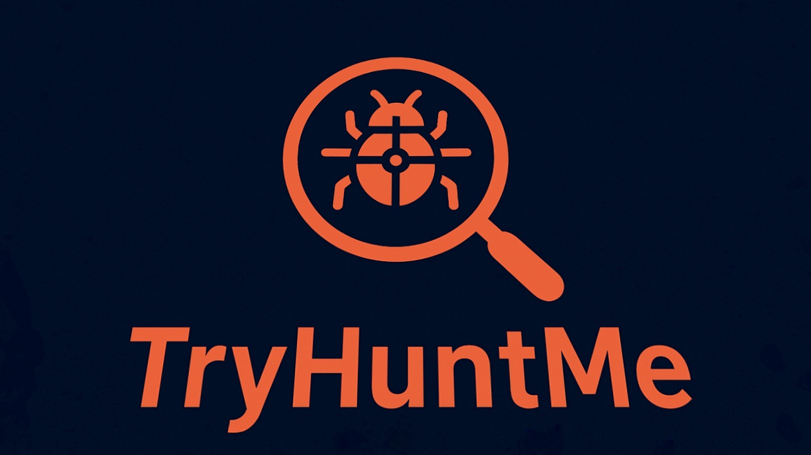

<p align="center">
  
</p>

<p align="center">
  
  
  
  
  
  
  
  
  <a href="https://github.com/KalloloCoder">
    
  </a>
</p>

# TryHuntMe
```
░▒▓████████▓▒░▒▓███████▓▒░░▒▓█▓▒░░▒▓█▓▒░▒▓█▓▒░░▒▓█▓▒░▒▓█▓▒░░▒▓█▓▒░▒▓███████▓▒░▒▓████████▓▒░▒▓██████████████▓▒░░▒▓████████▓▒░ 
   ░▒▓█▓▒░   ░▒▓█▓▒░░▒▓█▓▒░▒▓█▓▒░░▒▓█▓▒░▒▓█▓▒░░▒▓█▓▒░▒▓█▓▒░░▒▓█▓▒░▒▓█▓▒░░▒▓█▓▒░ ░▒▓█▓▒░   ░▒▓█▓▒░░▒▓█▓▒░░▒▓█▓▒░▒▓█▓▒░        
   ░▒▓█▓▒░   ░▒▓█▓▒░░▒▓█▓▒░▒▓█▓▒░░▒▓█▓▒░▒▓█▓▒░░▒▓█▓▒░▒▓█▓▒░░▒▓█▓▒░▒▓█▓▒░░▒▓█▓▒░ ░▒▓█▓▒░   ░▒▓█▓▒░░▒▓█▓▒░░▒▓█▓▒░▒▓█▓▒░        
   ░▒▓█▓▒░   ░▒▓███████▓▒░ ░▒▓██████▓▒░░▒▓████████▓▒░▒▓█▓▒░░▒▓█▓▒░▒▓█▓▒░░▒▓█▓▒░ ░▒▓█▓▒░   ░▒▓█▓▒░░▒▓█▓▒░░▒▓█▓▒░▒▓██████▓▒░   
   ░▒▓█▓▒░   ░▒▓█▓▒░░▒▓█▓▒░  ░▒▓█▓▒░   ░▒▓█▓▒░░▒▓█▓▒░▒▓█▓▒░░▒▓█▓▒░▒▓█▓▒░░▒▓█▓▒░ ░▒▓█▓▒░   ░▒▓█▓▒░░▒▓█▓▒░░▒▓█▓▒░▒▓█▓▒░        
   ░▒▓█▓▒░   ░▒▓█▓▒░░▒▓█▓▒░  ░▒▓█▓▒░   ░▒▓█▓▒░░▒▓█▓▒░▒▓█▓▒░░▒▓█▓▒░▒▓█▓▒░░▒▓█▓▒░ ░▒▓█▓▒░   ░▒▓█▓▒░░▒▓█▓▒░░▒▓█▓▒░▒▓█▓▒░        
   ░▒▓█▓▒░   ░▒▓█▓▒░░▒▓█▓▒░  ░▒▓█▓▒░   ░▒▓█▓▒░░▒▓█▓▒░░▒▓██████▓▒░░▒▓█▓▒░░▒▓█▓▒░ ░▒▓█▓▒░   ░▒▓█▓▒░░▒▓█▓▒░░▒▓█▓▒░▒▓████████▓▒░ 
```
> TryHuntMe is a CLI-based educational bug hunting toolkit.  
Perfect for learning recon, basic exploitation, payload obfuscation, and testing against a vulnerable local server.  

Copyright © KalloloCoder  

---

## Features

- **Reconnaissance Module** — scan targets with basic methods.  
- **PoC Generator** — automatically generate Proof of Concept payloads.  
- **Payload Obfuscator** — scramble payloads to evade detection.  
- **Local Vulnerable Server** — practice on a dummy vulnerable server.  
- **Report Generator** — export results as a markdown report.  

---

## Installation

### Linux / Termux (Android)

1. Clone the repo:
```bash
git clone https://github.com/KalloloCoder/TryHuntMe.git
cd TryHuntMe
```
2. Run:
```
python3 tryhuntme.py -h
```

### Windows (PowerShell)
```
git clone https://github.com/KalloloCoder/TryHuntMe.git
cd TryHuntMe
python tryhuntme.py -h
```

---

## Usage
```
usage: tryhuntme [-h] [-v] {start-server,recon,poc,report,about} ...

TryHuntMe — educational bug hunting toolkit (local only).

positional arguments:
  {start-server,recon,poc,report,about}
    start-server        Start the local vulnerable server for testing
    recon               Reconnaissance: basic port scan and DNS resolve
    poc                 Generate a simple PoC payload
    report              Generate a simple markdown report
    about               About TryHuntMe

options:
  -h, --help            show this help message and exit
  -v, --version         Show version info
```
### Examples

- Start local vulnerable server (default port 8000):
```
python3 tryhuntme.py start-server
```
- Recon module:
```
python3 tryhuntme.py recon -u http://target.com
```
- Generate PoC payload:
```
python3 tryhuntme.py poc -v xss
```
- Generate a markdown report:
```
python3 tryhuntme.py report
```
- About TryHuntMe:
```
python3 tryhuntme.py about
```

---

## Disclaimer

*TryHuntMe* is made for educational purposes only.
Do not use it to attack systems without explicit permission.
The author is not responsible for any misuse.

---

## Author

KalloloCoder(Muh. Agus Tri Ananda)— Creator & Maintainer
This project is open-source, contributions are welcome!

---

## Support

If you like this project, please give it a ⭐ on GitHub!

### Buy me a Coffee?


